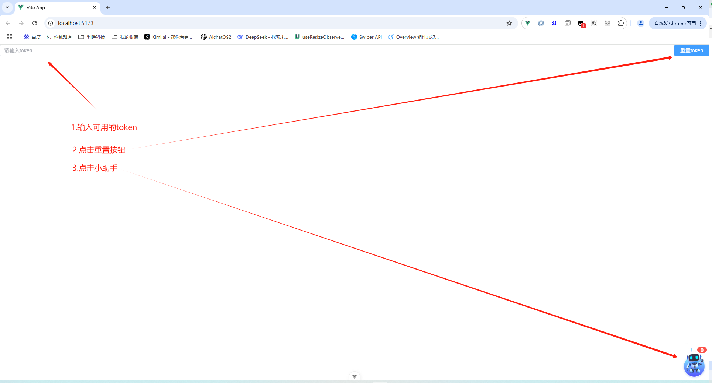
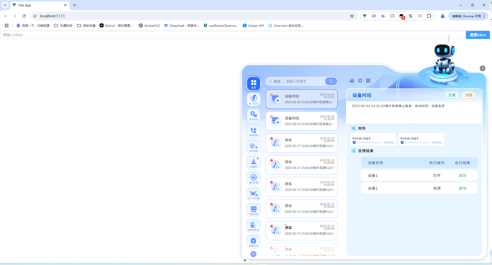

# alarm-helper
## 前言
**alarm-helper** 为一个基于 Vue 3 的组件库，主要用于告警即时信息管理，采用现代前端工程化方案。
以下是各主要文件和目录的作用说明：

```sh
alarm-helper/
    ├── build/ # 构建辅助脚本目录（如压缩脚本）
    ├── docs/ # 项目文档目录，包含开发介绍、规范等 Markdown 文档
    ├── lib/ # 组件库源码目录，包含 TypeScript、Vue 组件及工具函数等
        ├── api/ # 封装所有与后端接口相关的请求方法，便于统一管理和调用。
        ├── assets/ # 存放项目用到的图片、SVG、样式等静态资源。
        ├── audio/ # 存放音频文件或音频处理相关的代码，支持告警声音等功能。
        ├── comp/ # 公共组件目录，包含可在多个页面或模块中复用的 Vue 组件。
        ├── utils/ # 工具函数库，封装常用的 JavaScript/TypeScript 工具方法，提升开发效率。
        ├── views/ # 页面级组件或业务模块组件，通常对应具体业务场景。
        ├── defaults.ts # 项目的默认配置项或常量定义。
        ├── index.ts # 组件库的主入口文件，统一导出各模块、组件和工具函数，供外部引用。
    ├── dist/ # 构建输出目录，存放打包后的产物
    ├── types/ # 类型声明文件目录
    ├── scripts/ # 自动化脚本目录（如拷贝、构建相关脚本）
    ├── src/ # 应用源码目录
    ├── package.json # package.json，定义依赖、脚本等
    ├── vite.config.ts # vite 配置文件
```
## 依赖与工具

:tent:  **Vue 3** 及其生态（如 element-plus、vue-router）<br/>
:hammer: **Vite** 作为开发与构建工具<br/>
:soon: **TypeScript** 类型支持<br/>
:clock2: **ESLint、Prettier** 代码规范与格式化<br/>
:sagittarius: **Swiper、Axios、dayjs、qs** 等常用工具库

## 开发常用命令

- `npm run dev` 启动开发环境
- `npm run build` 生产环境打包


## 环境配置流程

为确保 alarm-helper 组件库能够顺利开发和运行，请按照以下步骤进行环境配置：

### 1. 安装 Node.js

建议使用 **Node.js 18.x 或以上版本**。可在 [Node.js 官网](https://nodejs.org/) 下载并安装。


### 2. 安装 pnpm（推荐）
本项目推荐使用 [pnpm](https://pnpm.io/) 作为包管理工具，提升依赖安装速度和一致性。
如未安装 pnpm，也可使用 npm 或 yarn，但建议统一团队工具。
```sh
npm install -g pnpm
```

### 3. 安装依赖
在项目根目录下执行：
```sh
pnpm install
```

### 4.  启动开发环境
配置开发环境配置
```js
// src/dev.ts
window.globalConfig = {
  AlarmCenterWsUrl: `172.17.0.88:18089`, // 告警中心Socket地址
  AlarmRobotApiContext: '/api/',
  AlarmStreamPath: `https://128.23.14.241:13000/api/GetCameraPlayURL`, //流媒体服务接口
  AlarmStreamDomain: `private`, //外网（public）还是内网（private）
  AlarmStreamRate: `slaver`, //获取主码流（master）或者副码流（slaver）
}
```
在项目根目录下执行：
```sh
pnpm run dev
```
:warning:注意事项
- 若需兼容 Vue2，UI 组件尽量避免引入第三方库。
- 如遇依赖冲突或安装缓慢，可尝试清理缓存：pnpm store prune 或 pnpm install --force。
- 推荐使用 VSCode 并安装相关插件（如 Volar、ESLint、Prettier）以获得最佳开发体验。

### 5.运行效果
- 1.输入可用的token
- 2.点击重置token效果
- 3.点击告警小助手

- 4.效果

